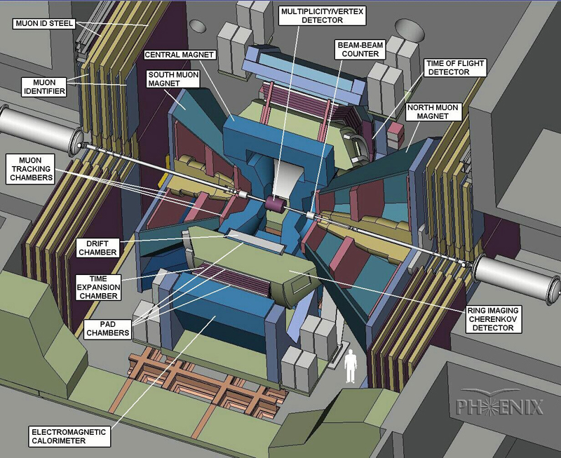

# PHENIX

미국 브룩해븐국립연구소(BNL)의 PHENIX 국제공동연구는 최초의 고에너지 충돌형 가속기인 Relativistic Heavy Ion Collider(RHIC)를 이용하여 고온, 고밀도 핵물질을 생성한 후 그 특성을 연구하고 있다. BNL 내의 STAR와 함께 가장 큰 규모의 연구로, 약 500여명의 핵, 입자 물리학자들이 모여 다양한 연구를 수행중이다. 특히 우리 연구실에서는 핵충돌 초기 최대 에너지밀도에 도달했을 당시의 핵물질을 연구하기 위하여 검출된 뮤온입자를 분석하고 J/psi 및 Υ와 같은 무거운 중간자의 생성 및 붕괴에 관한 연구를 수행하고 있다. 이를 위해 우리 연구실은 지난 10년 동안 뮤온 궤도 추적 검출기(CSC)의 개발 및 건설에 주도적으로 참여하여 왔고, 현재 여러 명의 석, 박사과정생이 BNL 현지에서 검출기의 운영 및 데이터 분석에 전력을 다하고 있다.
현재 PHENIX 실험은 성능 개선을 위한 대대적인 검출기 업그레이드 작업을 진행 중인데 우리 고려대학교 그룹은 특히 뮤온 트리거를 위한 저항판 검출기의 개발 및 생산을 담당하고 있으며, 현재 생산된 저항판 검출기를 설치중이다.

---
#### 바깥 고리
* [오픈랩2013 포스터](materials.md#오픈랩2013_PHENIX)

---

